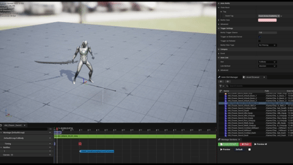
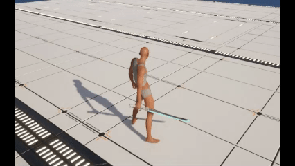
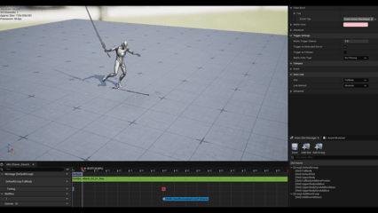
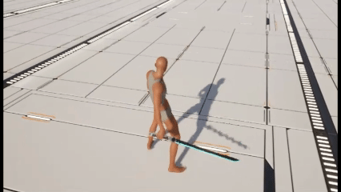
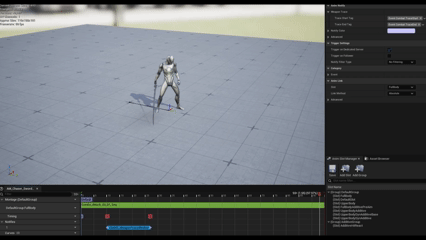
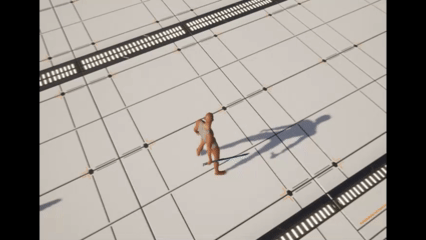
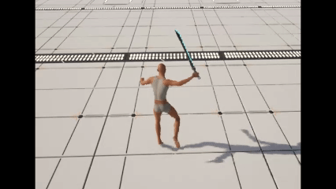

## 2 어빌리티 아키텍처

### 2.1 어빌리티 계층 구조

`Action Ability`
- 몽타주 재생, 종료 요청
- 몽타주 끝나면 어빌리티 종료함
- 태그 이벤트 대기 (애님 노티파이에서 전송 `Event_Action_EndAbility`)
  - 어빌리티 종료 태그

`Event Action Ability` (서버 전용)
- 게임플레이 이벤트로 트리거되는 액션 어빌리티.
- 이벤트는 서버에서 발행되므로 기본적으로 서버에서만 활성화함.
- 피격 어빌리티, 사망 어빌리티 등이 있음 (이벤트 받으면 실행됨)

`AI Attack Ability` (서버 전용)
- AI 공격 어빌리티는 BT 태스크 노드에서 활성화함
  - `UCBBTTask_ActivateAbility`, `UCBBTTask_ActivateAbilityAndWait`
- AI 관련 작업은 모두 서버에서 처리함.
- 데미지 GE 와 데미지 계수 설정 (어빌리티 마다 데미지 다르게 가능)
- **랜덤 공격 여부 (공격 액션 랜덤으로 재생)**
- 태그 이벤트 대기 (애님 노티파이에서 전송 `UCBAN_SendGameplayEventToOwner`)
  - `Event_Combat_TraceStart`, `Event_Combat_TraceEnd` 이벤트 대기
  - 몽타주의 노티파이 스테이트 구간에서 트레이스 활성화 (`UCBANS_WeaponTraceWindow`)

`Input Action Ability`
- 입력으로 활성화하는 액션 어빌리티
- 입력을 누르고 있으면 계속 활성화할지 설정
- 태그 이벤트 대기 (애님 노티파이에서 전송 `UCBAN_SendGameplayEventToOwner`)
  - `Event_Action_CheckInput` 이벤트 대기
  - 입력 감지 시작 (이때 입력을 누르거나 누르고 있으면 재활성화)

`Chaser Attack Ability`
- 플레이어 공격 어빌리티
- 데미지 GE 와 데미지 계수 설정 (어빌리티 마다 데미지 다르게 가능)
- **콤보 공격 여부 (재활성화할때마다 다음 콤보 시작)**
- 태그 이벤트 대기 (애님 노티파이에서 전송 `UCBAN_SendGameplayEventToOwner`)
  - `Event_Combat_TraceStart`, `Event_Combat_TraceEnd` 이벤트 대기
  - 몽타주의 노티파이 스테이트 구간에서 트레이스 활성화 (`UCBANS_WeaponTraceWindow`)

### 2.2 태그 이벤트 노티파이

노티파이를 통해 자신의 GAS 에게 태그 이벤트 전송 가능

---

### 2.3 액션 어빌리티 실행 흐름

**모든 액션(몽타주) 어빌리티가 공유하는 재생 → 종료 골격.**

- 몽타주는 직접 재생하지 않고 `GameplayCue.PlayAction` 으로 실행 — 액션 태그와 재생 인덱스를 큐 파라미터로 실어 전 클라이언트가 같은 몽타주를 재생함.
- 종료 경로는 3가지이고, 어느 쪽으로 끝나든 정리 훅(`CleanupActionState()`)을 한 번 태움.
  - 정상 종료 — 애님 노티파이가 보낸 `Event_Action_EndAbility` 수신 → 몽타주 정지 + 상태 정리
  - 폴백 종료 — 몽타주 길이만큼의 `WaitDelay`. 노티파이가 없거나 유실돼도 어빌리티가 남지 않음
  - 캔슬 종료 — 피격·사망 등으로 끊긴 경우. 서버에서만 몽타주 정지를 요청함
- 자식은 확장 훅만 채우고, 재생·종료 규칙은 베이스가 책임짐.
  - `SelectActionMontageIndex()` — 재생 인덱스 결정 (콤보 전진 · 무작위 선택)
  - `BuildActionCueParameters()` — 큐 파라미터 추가 (모션 워핑 타겟 등)
  - `OnActionMontageStarted()` — 재생 직후 후처리 (입력 윈도우 대기 등)
  - `CleanupActionState()` — 종료 시 자식 상태 정리
  - `ShouldStopActionOnEnd()` — 사망처럼 마지막 프레임을 유지할지 여부

#### 💡 `Event_Action_EndAbility` 태그 이벤트

몽타주 원하는 지점에 노티파이로 Event_Action_EndAbility 태그 이벤트를 보내면 원하는 곳에서 어빌리티 종료할 수 있음.
- 종료 모션이 긴 몽타주를 원하는 곳에서 끊고 싶을 때 사용 가능

---

### 2.4 입력 액션 어빌리티

**입력 태그로 발동하고, 몽타주 중간의 노티파이 구간에서 다음 입력을 받아 재활성화한다.** (`LocalPredicted`)

- 몽타주 재생은 베이스가 아니라 자식이 조건을 검사한 뒤 호출함.
- `Event_Action_CheckInput` 을 받으면 그 시점의 입력 상태로 갈라짐.
  - 입력을 누르고 있으면 — 즉시 종료 후 재활성화해서 끊김 없이 다음 액션으로 이어짐
  - 입력이 없으면 — 입력 대기 윈도우를 열어 두고, 그 사이 입력이 오면 재활성화 / 끝까지 없으면 몽타주와 함께 종료
- 입력 감지는 내가 조종하는 로컬 캐릭터에서만 수행함 (`IsLocallyControlled`).

#### 💡 `Event_Action_CheckInput` 태그 이벤트

몽타주의 원하는 지점부터 입력을 감지하기 시작.
- 감지 시작 이후에도 입력을 계속 누르고 있거나 종료 전에 입력을 누르면 어빌리티 재활성화

---

### 2.5 Chaser 공격 어빌리티

**입력 액션 어빌리티에 콤보 인덱스와 트레이스·데미지를 더한 엣지 클래스.** (`LocalPredicted`)

- 활성화 가드 — 무기 보유 · 전투 모드 · 재생 가능 여부를 확인한 뒤 쿨다운 GE 커밋.
- 콤보 인덱스는 예측키와 함께 전진시키고, 서버가 활성화를 거부하면 그 전진만 되돌림(`RollbackCombo`).
- 트레이스 구간은 몽타주의 노티파이 스테이트(`UCBANS_WeaponTraceWindow`)가 열고 닫음.
  - 로컬 — `TraceStart`/`TraceEnd` 를 받아 무기 트레이스를 켜고 끔. 히트는 로컬에서 감지해 서버로 보고
  - 서버 — `Event_Combat_Attack_Hit` 을 받아 검증된 타겟에 데미지 GE 적용 (계수는 SetByCaller)
- 액션이 끝나면 콤보 체인을 닫고, `EndAbility` 에서 트레이스를 한 번 더 정지시켜 캔슬로 노티파이를 놓쳐도 트레이스가 남지 않게 함.

### 2.6 AI 공격 어빌리티

**BT 태스크가 직접 활성화하고 서버에서만 실행한다.** (`ServerOnly`) — 몽타주는 GameplayCue 로 전 클라이언트에 동기화되므로 복제 실행이 필요 없음.

- 활성화 전 무기 보유를 `CanActivateAbility` 에서 검사해, 무기가 없으면 BT 태스크 단계에서 막힘.
- 변형 몽타주를 무작위로 고르되 **서버에서 한 번만 뽑아** 큐 인덱스로 전파 → 전 클라이언트가 같은 모션을 봄.
- 블랙보드의 추격 타겟을 큐 파라미터에 실어 모션 워핑 대상으로 사용 (`WarpStopDistance` 만큼 남기고 접근).
- 트레이스·히트·데미지 처리가 전부 서버 한 곳에서 일어남 (플레이어 공격처럼 로컬/서버로 나뉘지 않음).

#### 💡`Event_Combat_TraceStart` / `Event_Combat_TraceStop` 노티파이 스테이트

몽타주 원하는 구간에서 트레이스를 활성화할 수 있음.
- 트레이스 처리는 컴뱃 컴포넌트에서 처리.

---

### 2.7 이벤트 액션 어빌리티

**입력이 아니라 서버가 발행한 게임플레이 이벤트로 자동 발동한다.** (`ServerInitiated`)

- 자식 생성자에서 `RegisterEventTrigger()` 로 발동 이벤트 태그를 등록하면, 그 이벤트를 받을 때 자동 활성화됨.
- 발동 시 `CancelActionTag` 로 진행 중인 액션을 캔슬함 (예: 공격을 휘두르는 중 피격 → 공격만 끊고 피격 모션).
- 피격 — `Event_Combat_HitReact` 로 발동. 슈퍼아머 태그가 있으면 반응 모션만 생략하고 데미지는 그대로 적용. 전투/비전투에 따라 인덱스를 고르는데, 복제되는 태그라 클라와 서버의 계산 결과가 같음.
- 사망 — `Event_Combat_Death` 로 발동. 모든 어빌리티를 캔슬하고 사망 GE 를 몽타주보다 먼저 적용하며, 차단 태그를 무시해 시전 중 사망도 반드시 발동함. `ShouldStopActionOnEnd()` 가 false 라 마지막 프레임을 유지함.
- 이벤트가 서버에서만 발행되므로 클라이언트 예측이 없고, 몽타주만 GameplayCue 로 전 클라이언트에 동기화됨.

---

### +) 여러 노티파이 사용을 통해 원하는 몽타주 연출 가능

콤보 공격 + 종료 시점 + 입력 감지 시점 + 트레이스 활성화 구간 모두 설정 가능

