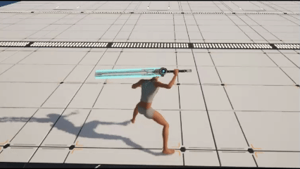
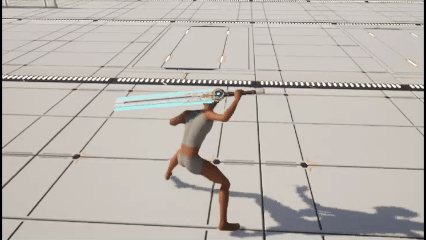

## 3 액션 시스템

### 3.1 액션 시스템 구조

캐릭터가 사용하는 모든 몽타주를 한 곳에 모아두고, 액션 컴포넌트와 액션 어빌리티를 통해 재생함.
- 몽타주는 데이터 에셋에 태그와 몽타주 쌍으로 등록
- 액션 어빌리티 등 외부에서 액션 태그를 통해 몽타주 재생 요청
- 하나의 태그에 여러 몽타주 등록 가능
  - 콤보 공격, 랜덤 공격, 전투/비전투별 애니메이션 등
  - 재생 요청하는 곳에서 어느 몽타주를 재생할지 담아서 요청
- 공격 속도 영향 받는 몽타주 설정 여부
  - 몽타주 재생할 때 공격 속도 (Attribute) 를 확인해 PlayRate 적용

### 3.2 몽타주 데이터 에셋 — 태그 + 인덱스

**데이터 에셋은 순수 조회 테이블이고, 인덱스의 의미는 데이터가 아니라 호출자가 정한다.**

싱글과 콤보를 구분해 저장하지 않고 엔트리 하나(태그 → 몽타주 배열)로 통합했음. 1개면 단일 액션, 여러 개면 콤보나 변형 풀이 되는데, 그 해석은 인덱스를 넘기는 쪽이 결정함.

| 액션 태그 | 몽타주 배열 | 인덱스 해석 | 정하는 곳 |
|---|---|---|---|
| `Action.Combat.Attack.Basic` | 1타 · 2타 · 3타 | 콤보 단계 | 공격 어빌리티가 콤보를 전진시킴 |
| `Action.Combat.HitReact` | 일반 피격 · 전투 피격 | 전투 상태 | 피격 어빌리티가 전투 태그로 분기 |
| `Action.Combat.EquipWeapon` | Idle · Walk · Run | 개이트 | 공용 헬퍼가 이동 상태로 분기 |
| `Action.Movement.Dash` | 비전투 · 전투 | 전투 상태 | 대시 어빌리티가 분기 |

- AI 공격은 같은 배열을 **무작위 추첨**으로 해석함 — 데이터 구조는 그대로고 해석하는 호출자만 다름.
- 엔트리마다 공격 속도 영향 여부를 두어, 해당 몽타주만 재생 시 공격 속도 어트리뷰트를 PlayRate 에 반영함.
- 에디터에서는 배열로 편집하고, 로드 시 태그 → 엔트리 맵으로 변환해 조회함.
- 외부는 데이터 에셋을 직접 참조하지 않고 액션 컴포넌트를 통해서만 접근함 (몽타주 개수 조회 등).

#### 💡공격 속도 영향받는 몽타주 설정

공격 속도에 따라 빠르게 재생하고 싶은 몽타주를 별도로 설정 가능

### 3.3 몽타주 재생 흐름

**어빌리티는 재생할 인덱스만 정하고, 조회와 재생은 각 머신의 액션 컴포넌트가 한다.**

1. 어빌리티가 재생 인덱스를 결정함 (콤보 전진 · 무작위 추첨 · 상태 분기)
2. 액션 태그와 인덱스를 게임플레이 큐 파라미터에 실어 `GameplayCue.PlayAction` 실행
3. 각 머신의 큐 노티파이가 태그와 인덱스를 꺼내 액션 컴포넌트에 재생 요청
4. 액션 컴포넌트가 데이터 에셋에서 몽타주를 찾아 재생 (공격 속도 영향 몽타주면 PlayRate 반영)

서버가 몽타주를 직접 재생하지 않고 **인덱스를 큐로 전달**하기 때문에, 시뮬레이티드 프록시도 서버와 같은 클립을 재생함.

### 3.4 액션 어빌리티 동기화

어빌리티는 시뮬 프록시에서만 활성화 되지 않기 때문에 몽타주 재생/중지가 로컬과 서버에서만 됨.

게임플레이 큐를 통해 시뮬 프록시까지 신호를 보내 몽타주 재생/중지를 맞추도록 함.

태그 이벤트나, 애님 노티파이, 트레이스 등 무거운 작업은 시뮬 프록시에서는 처리 안함.
- 서버 복제 경로를 통해 결과만 받아서 동기화

### 3.5 정지도 큐를 경유한다 — 루트 모션 때문

**액션 몽타주는 애님 노티파이로 중간에서 끊는 것을 전제로 설계했음.**
- 긴 몽타주의 회수 동작을 잘라내기 위한 것인데, 이 "끊는 시점"이 머신마다 어긋나면 루트 모션 이동량이 달라져 캡슐 위치가 벌어짐.
- 그러면 캐릭터 무브먼트가 이를 오차로 보고 클라이언트를 되돌려서, 화면에서는 캐릭터가 버벅이며 위치 보정되는 것으로 보임.
- 끝까지 재생하면 오차가 없었음 → 엔진의 루트 모션 동기화는 정상이고 **정지 시점만 문제**였다는 진단.
- 정지를 어빌리티가 직접 하면 시뮬 프록시는 멈출 주체가 없어 그 화면에서만 몽타주가 끝까지 재생됨. **재생을 큐로 하는 이유가 정지에도 그대로 적용됨.**
- 재생 큐와 정지 큐가 같은 경로로 같은 지연을 겪으므로 지연이 상쇄되고, 세 머신이 **같은 몽타주 위치**에서 멈춤.

> 진단 과정과 타이밍 검증은 [Docs/Tech/Montage.md](../Tech/Montage.md) 에 정리함.

### 3.6 예외 — 마지막 프레임을 유지하는 액션

시체 포즈처럼 몽타주가 끝난 뒤에도 마지막 프레임을 유지해야 하는 액션이 있음. **코드와 에셋 양쪽을 맞춰야 하고, 한쪽만 하면 조용히 원래대로 돌아감.**

| 막아야 하는 것 | 해제 방법 |
|---|---|
| 종료 시 정지 큐 | 어빌리티가 정지 훅을 꺼서 정지 요청을 건너뜀 |
| 몽타주가 끝에서 스스로 블렌드 아웃 | 몽타주 에셋의 `Enable Auto Blend Out` 해제 |

현재 이 예외를 쓰는 건 사망 어빌리티 하나임.

- > [Notion - 사망 몽타주 유지](https://sprout-whitefish-298.notion.site/v1-2-3cf2a74e9c6f80e9bfd4cb2f45666c04?pvs=143)