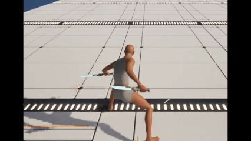

## 4 이동/로코모션 시스템

### 4.1 이동/로코모션 구조

**입력을 통해 ASC 와 CMC 에 태그 추가/제거 및 속도를 추가하면 이동/회전 컴포넌트에서 실시간으로 읽어서 상태 업데이트하고 관련 작업 처리함**
- 걷기, 대시, 전력질주 모두 어빌리티로 태그 추가함.
- 태그를 통해 캐릭터에 이동 속도 적용함.

`Locomotion Processor`
- 캐릭터의 이동 관련 데이터를 처리하는 컴포넌트
- 개이트별 가속/감속 처리, 개이트(Walk/Run/Sprint) 판정 및 처리, 개이트 태그 부여/제거
- Idle / InAir 판단 및 태그 부여/제거

`Character Rotation Component`
- 캐릭터의 회전 관련 데이터를 처리하는 컴포넌트
- 개이트별 회전 속도 및 회전 보간

`Input Manager Component`
- 사용자의 입력을 받아 이동을 적용하고, 피벗을 감지해 이동 입력을 잠금
- 입력 등록·바인딩 구조는 [5 입력 시스템](05-input-system.md) 참고

**+) 무브먼트 데이터 에셋에서 이동,회전속도 및 피벗 각도, 잠금 시간 등 커스텀 가능**

**+) 애님 BP 에서는 매 프레임 ASC와 CMC를 읽어서 애니메이션 전환 및 재생에 사용**

### 4.2 개이트 = ASC 태그

**이동 · 회전 · 애니메이션 · 몽타주가 모두 같은 태그 하나를 읽는다.**

- 개이트는 ASC 의 `Status.Movement.Gait.*` 태그로 표현하고, 항상 정확히 하나만 유지함.
  - **의도(Walk / Sprint)** — 어빌리티가 입력을 누르는 동안 GE 로 태그와 이동 속도를 함께 부여하고, 떼면 제거함.
  - **파생(Run)** — Walk · Sprint 가 둘 다 없을 때 로코모션 프로세서가 부여함.
- 판별 우선순위(Sprint > Walk > Run)는 공용 헬퍼 하나로 통일했음. 애님 인스턴스 · 회전 컴포넌트 · 입력 매니저 · 몽타주 인덱스 계산이 전부 같은 함수를 씀.
- 덕분에 개이트를 소비하는 곳이 서로를 몰라도 됨.

| 소비자 | 태그로 결정하는 것 |
|---|---|
| CMC | 최대 속도 · 가속 · 감속 |
| 회전 컴포넌트 | 회전 보간 속도, 회전 타겟(카메라 / 이동 방향) |
| ABP 상태 머신 | 개이트별 애니메이션 선택 |
| 액션(몽타주) | 무기 장착처럼 개이트 변형이 있는 액션의 재생 인덱스 |

### 4.3 무브먼트 데이터 에셋

**개이트별 튜닝 값은 전부 데이터 에셋 한 곳에 두고, 컴포넌트는 폴백만 가짐.**

개이트 태그 하나에 이동 관련 값이 묶여 있어서, 새 개이트를 추가하거나 캐릭터별로 감을 바꿀 때 코드를 건드리지 않음.

| 값 | 쓰는 곳 | 비고 |
|---|---|---|
| 최대 속도 | 이동 속도 GE / CMC | 개이트 태그와 함께 부여 |
| 최대 가속도 | 로코모션 프로세서 → CMC | 클수록 목표 속도까지 빨리 붙음 |
| 제동 감속도 | 로코모션 프로세서 → CMC | 작을수록 오래 미끄러짐 (질주는 낮게) |
| 회전 보간 속도 | 회전 컴포넌트 | 작을수록 느리게 돌아감 (질주는 낮게) |
| 피벗 각도 임계 | 입력 매니저 | 낮을수록 민감 |
| 피벗 입력 잠금 시간 | 입력 매니저 | 질주는 길게 |

- 데이터 에셋은 **로드아웃이 캐릭터에 주입**하고 런타임에 교체되지 않으므로, 소비하는 쪽은 한 번만 캐싱해서 재사용함.
- 값이 없으면 각 컴포넌트의 폴백 값으로 동작함 — 에셋을 붙이지 않아도 캐릭터가 움직이지 않는 상황은 생기지 않음.

### 4.4 로코모션 프로세서

**파생 상태 태그의 단일 소유자이면서, 개이트별 가속/감속을 CMC 에 반영하는 컴포넌트.**

#### 파생 상태 태그 미러링

어빌리티가 진입점이 될 수 없는 물리 파생 상태(Idle / InAir / Run)는 이 컴포넌트가 각 머신에서 **로컬로 계산해 비복제 태그로 부여**함.

CMC 가 이미 복제되므로 서버 · 소유 클라 · 시뮬 프록시가 각자 같은 결론에 도달함 — **태그를 위한 네트워크 코드가 따로 없음.**

| 태그 | 갱신 방식 | 판정 |
|---|---|---|
| `Status.Movement.Idle` | 매 틱 (속도 기반) | 가속이 없고 수평 속도가 임계 이하. (진입/이탈 임계를 다르게 둔 **히스테리시스**로 경계에서 깜빡이지 않게 함) |
| `Status.Movement.InAir` | 무브먼트 모드 변경 이벤트 | 낙하 중인지 여부 (틱 불필요) |
| `Status.Movement.Gait.Run` | 개이트 태그 변경 이벤트 | Walk · Sprint 의도 태그가 둘 다 없으면 부여 |

- **전이 시점에만 부여/제거**함. 루스 태그는 카운트 방식이라 매 틱 부여하면 카운트가 누적됨.
- 의도 태그(Walk / Sprint)는 **읽기만** 하고 쓰지 않음 — 읽는 태그와 쓰는 태그를 분리해 피드백 루프를 막음.
- 종료 시 태그와 구독을 정리함. 플레이어 ASC 는 PlayerState 소유라 캐릭터보다 오래 살아서, 안 지우면 태그가 남음.

#### 가속 · 감속

- 매 틱 개이트 데이터를 **한 번만 조회**해서 가속과 감속이 같은 구조체를 공유하도록 함.
- **대시 중에는 개이트보다 대시 감속이 우선**함. 루트모션 대시는 속도가 개이트 최대 속도보다 훨씬 높아 따로 튜닝해야 함.
- 대시 태그가 사라진 뒤에도 일정 시간 대시 감속을 유지함 — 몽타주가 끝난 직후 남은 고속 구간까지 같은 감속으로 처리하기 위함.

### 4.5 캐릭터 회전

**개이트에 따라 바라보는 기준이 다르고, 복제하는 것은 목표 회전뿐임.**

| 개이트 | 회전 타겟 | 이동 적용 |
|---|---|---|
| Walk · Run | 카메라 방향 (aim-facing) | 몸 기준 전후 · 좌우 분해 (스트레이핑) |
| Sprint | 이동 입력 방향 (orient-to-movement) | 몸 정면으로 직진만 — 방향은 회전이 전담 |

- Sprint 에서 전후·좌우를 분해하면 이미 회전한 몸에 방향이 이중으로 적용되어 엉뚱한 곳으로 감. 그래서 이동은 정면 직진만 시킴.
- 질주 애니메이션은 전방 클립 하나로 8방향을 커버함 — 몸이 입력 방향을 향하기 때문.

**복제는 목표 회전만 함**

1. 로컬에서 개이트에 맞는 목표 회전을 계산함
2. 값이 실제로 바뀌었을 때만 서버로 전송함 (**Unreliable**)
3. 서버가 그 값을 복제함 (이미 알고 있는 오너는 제외)
4. 각 머신이 개이트별 보간 속도로 부드럽게 따라감

회전은 매 틱 갱신되는 연속 상태라 **최신 값만 맞으면 됨.** 중간에 하나를 놓쳐도 다음 갱신이 덮으므로 Reliable 이 필요 없음. 회전 결과값이 아니라 목표만 보내고 보간은 각자 하기 때문에 전송량도 적음.

**루트모션 재생 중에는 회전을 갱신하지 않음**

- 엔진은 루트모션을 그 프레임의 액터 회전 기준으로 월드 변환함. 계속 회전을 갱신하면 대시·공격 궤적이 재생 도중 입력을 따라 꺾임.
- 특정 어빌리티 태그가 아니라 **루트모션 재생 여부 자체로 막기** 때문에, 앞으로 추가되는 루트모션 몽타주에도 그대로 적용됨.
- 몽타주 도중 타겟 쪽으로 정렬해야 하면 회전이 아니라 모션 워핑이 담당함.

### 4.6 피벗 — 급반전 처리

**전용 스테이트나 애니메이션 없이, 이동 입력을 잠깐 잠가서 기존 정지/출발 모션으로 급반전을 표현함.**

판정은 세 관문을 모두 통과해야 함.

1. **지상인가** — 공중 방향 전환에 잠금이 걸리면 오동작하므로 제외
2. **충분히 빠른가** — 개이트 최대 속도 대비 일정 비율 이상. 저속에서의 방향 전환은 그냥 돌면 됨
3. **각도가 큰가** — 입력 방향과 현재 속도 방향의 각도가 개이트별 임계를 넘는지

통과하면 이번 입력을 버리고 개이트별 시간만큼 이동 입력을 잠금.

- **잠금 중** — 입력이 끊긴 상태가 되어 자연 감속하고, 애님은 Stop 구간으로 전이함
- **해제 후** — 입력을 계속 누르고 있었다면 새 방향으로 Start 부터 다시 재생함. 짧게 눌렀다 떼면 그대로 Idle
- 잠그는 건 **이동 입력뿐**이라 시점 조작과 어빌리티 입력은 그대로 동작함
- 잠금은 로컬 입력 처리 단계에서만 일어나고, 이동 자체는 기존 복제·예측 경로를 그대로 탐

ABP 를 건드리지 않고 데이터 값(각도 임계·잠금 시간)만으로 개이트별 감을 조절할 수 있는 게 이 방식의 장점.

> [Notion - 피벗 기능](https://sprout-whitefish-298.notion.site/v1-5_-3972a74e9c6f8025b665ff74a4e5b04f)

### 4.7 캐릭터 애님

**애님BP 관련 설정**

- 블렌드 설정 - [Notion - 블렌드 회전 규칙 변경](https://app.notion.com/p/39d2a74e9c6f8080abb7e82b08f6aefd?source=copy_link)

- 관성화 설정 - [Notion - 애니메이션 전환 개선](https://app.notion.com/p/v1-6_-39a2a74e9c6f807b98d0f05389a31183?source=copy_link)

- 싱크 설정 - [Notion - 애니메이션 싱크 맞추기](https://app.notion.com/p/v2-2-39f2a74e9c6f801f8d31d31705d246f5?source=copy_link)

- 슬롯 채널 설정 - [Notion - 소스 포즈 업데이트 설정](https://app.notion.com/p/3c52a74e9c6f80288516fb62f5b60f1e?source=copy_link)

- 스냅샷 설정 - [Notion - 직전 상태 저장](https://app.notion.com/p/v1-9-39b2a74e9c6f80f2a119fedcd56840d5?source=copy_link)

> 출발/정지 판정, 상태 머신 배선, 대시·점프 규칙은 [Docs/Tech/Locomotion.md](../Tech/Locomotion.md) 에 정리함.
