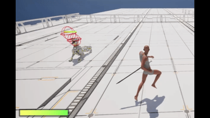

## 6 전투 시스템

### 6.1 전투 시스템 구조


**무기는 붙을 위치와 트레이스용 두 지점만 내주고, 스폰 · 수명 · 히트 판정 · 상태는 전부 컴뱃 컴포넌트가 가짐.**

- 전투 시스템은 **컴뱃 컴포넌트**와 **무기 액터** 두 축으로 이뤄짐. 둘 다 캐릭터 계열(플레이어 / 고급 적 / 일반 적)에 맞춰 자식을 두지만, **자식은 멤버 없이 로직이 갈릴 자리만 확보**해둔 상태임.
- 역할 분담이 단순함.
  - 컴뱃 컴포넌트 — 무기 저장소 · 수명 · 트레이스 · 히트 검증 · 전투 상태 · 콤보를 전부 소유
  - 무기 액터 — 어디에 붙는지(소켓)와 트레이스가 읽을 두 지점(Root · Tip)만 제공. 데미지도 콜리전도 갖지 않음
- 둘을 잇는 데이터는 **무기 데이터 에셋 하나**. 로드아웃에 등록해두면 캐릭터 초기화 때 컴뱃 컴포넌트로 전달되어 스폰 · 부착 · 등록까지 이어짐.
- 어빌리티는 컴뱃 컴포넌트의 API 만 호출함 — 무기를 직접 찾지도, 상태 태그를 직접 붙이지도 않음.

> 🔎 공격 어빌리티 쪽 구조(활성화 가드 · 콤보 전진 · 종료 경로)는 [2 어빌리티 아키텍처](02-ability-architecture.md) 참고

---

### 6.2 무기 클래스


#### 6.2.1 무기 소켓


**무기는 소켓 데이터를 관리하고, 무기 부착과 소켓 위치 API 를 제공함.**

- 무기가 하는 일은 **부착**과 **위치 제공** 둘뿐. 데미지 · 콜리전 · 히트 판정은 갖지 않음.
- 전투 시 붙을 소켓과 비전투 시 붙을 소켓(칼집)을 따로 설정함.
- 무기의 Root 와 Tip 소켓을 설정 - 트레이스 범위에 사용

#### 6.2.2 트레이스 소켓


#### 6.2.3 무기 소켓 데이터 에셋


모든 무기의 소켓 이름을 모아둠 (외부 조회용)
- 무기 클래스에서 데이터 에셋을 읽어서 소켓 타입만 맞춰주면 소켓 이름 반영해줌 (에디터용)
- **소켓 타입은 무기 종류가 아니라 "어느 슬롯을 점유하는가"** 를 뜻함. 쌍수 단검이 `Dagger (Left)` / `Dagger (Right)` 로 나뉘는 이유임.
- 캐릭터마다 스켈레톤 소켓 이름이 다를 수 있어 Chaser / Outlaw / Rogue 별로 에셋을 따로 둠.

#### 6.2.4 무기 데이터 에셋


**실제 로드아웃에 무기를 등록할 때 무기 데이터 에셋에 담아서 등록**

| 항목 | 쓰임 |
|---|---|
| 소켓 타입 | 이 무기가 점유할 슬롯. 등록 중복 검사 기준 |
| 무기 클래스 | 스폰할 무기 액터 (일반 무기 / 본체 무기) |
| 무기 데미지 | 히트 시 적용할 기본 데미지 |
| 공격력 GE | 등록 시 ASC 에 적용할 공격력 이펙트 |

- 무기를 하나 더 늘릴 때 **데이터 에셋만 만들어 로드아웃에 넣으면 됨** — 컴뱃 컴포넌트도 어빌리티도 수정하지 않음.

---

### 6.3 본체 무기


**무기를 들지 않는 몬스터(발톱 · 이빨)도 '무기'로 등록해서 기존 전투 파이프라인을 그대로 씀.**

컴뱃 컴포넌트의 기능(무기 유효성 · 트레이스 · 히트 검증 · 공격력 GE)이 전부 **등록된 무기 하나**에 걸려 있음. 그래서 맨손 몬스터를 위해 무기 개념을 우회하는 것보다, **트레이스 소스만 바꾼 무기**를 하나 등록하는 쪽이 변경 범위가 훨씬 작았음.

- 재정의하는 것은 **위치 getter 둘뿐** — 무기 메시 대신 오너 캐릭터의 스켈레탈 메시에서 소켓을 조회함.
- 등록 · 공격력 GE · 트레이스 루프 · 히트 검증은 **한 줄도 바뀌지 않음.**
- 오너 메시는 스폰 시 지정된 Owner 로 찾음 — Owner 는 복제되므로 서버 · 클라이언트가 같은 경로를 타고, 매 틱 조회를 피해 약참조로 지연 캐싱함.
- 소켓을 점유하지 않으므로(`None`) 등록 중복 검사에서 제외됨. 양 앞발처럼 부위가 둘이면 2개까지 등록 가능.

#### 💡 설계상 주의 세 가지

| 주의 | 이유 |
|---|---|
| **빈 메시 무기로는 대체할 수 없음** | 소켓 없는 빈 메시의 소켓 조회는 컴포넌트 자기 위치를 돌려줌 → Root == Tip == 부착 지점이 되어 판정이 사라짐. 그래서 빈 메시 소켓이 아니라 **스켈레탈 메시 소켓**을 씀 |
| **두 소켓은 반드시 떨어뜨릴 것** | 트레이스는 Root → Tip 소켓 사이를 판정 구간으로 씀. 두 지점이 같으면 분할마다 같은 트레이스를 중복 발사하고 판정 면이 점으로 쪼그라듦. 발톱이면 손목 / 발톱 끝처럼 벌려 잡을 것 |
| **소켓 이름 오타는 조용히 실패함** | 못 찾으면 캐릭터 원점이 반환되어 엉뚱한 곳에서 판정이 남 → 오너 메시를 처음 찾은 시점에 이름 존재를 1회 검증해 경고를 남김 |

본 이름을 그대로 써도 됨 - 스켈레탈 메시의 소켓 조회는 소켓뿐 아니라 본 이름도 받음. 다만 본은 관절 위치라 발톱 끝 같은 지점은 소켓을 따로 심는 편이 정확함.

> 🔎 관련 문서 [Notion - 바디 무기 클래스](https://sprout-whitefish-298.notion.site/v1-2-3cc2a74e9c6f80b78a58ea5ecf371932?pvs=143)

본체 무기 소켓 세팅 :




---

### 6.4 무기 등록과 수명


**등록은 로드아웃이 부르고 서버만 수행하며, 정리는 컴포넌트가 끝나는 시점 한 곳이 책임짐.**

로드아웃 안에 무기 데이터 에셋을 넣으면 로드 시 컴뱃 컴포넌트의 무기 등록 API 와 함께 넘김.

**등록 규칙**

- 최대 2개 — 쌍수 무기는 왼손 · 오른손을 **별개로 등록**함.
- 중복 검사 기준은 **소켓 점유** — 한 소켓엔 무기 하나. 소켓을 점유하지 않는 무기(본체 · 소환형)는 검사에서 제외.
- 무기 BP 와 데이터 에셋의 소켓 타입이 다르면 경고를 남김 (등록은 계속 진행) — 설정 실수를 런타임 전에 알아채기 위함.

**수명 정리**

- 무기는 부착으로도 소유(Owner)로도 파괴가 전파되지 않음. 캐릭터가 사라져도 **월드에 그대로 남으므로** 컴포넌트가 직접 파괴함.
- 캐릭터의 파괴 시점이 아니라 **컴포넌트가 끝나는 시점**에 정리하는 이유 - 명시적 파괴뿐 아니라 맵 전환 · 종료까지 덮고, 무기 저장소와 수명이 한 클래스 안에 모임.
- 무기는 복제 액터라 서버에서 파괴하면 전 클라이언트에서 함께 사라짐.

#### 왜 소유 폰이 파괴될 때 직접 정리해야 하나

**플레이어의 ASC 는 PlayerState 소유라 폰을 파괴해도 살아있음.** 폰이 바뀌어도 GE 와 루스 태그는 그대로 남아서, 걷어내지 않으면 다음 폰까지 이월됨.

- **공격력 GE** - 남기면 죽을 때마다 · 캐릭터를 바꿀 때마다 새 폰이 적용하는 GE 가 그 위에 쌓여 **공격력이 무한히 올라감.**
- **전투 상태 태그** - 남기면 새 폰이 무기를 칼집에 둔 채 전투 상태로 시작할 수 있음. 이때 장착 어빌리티는 "이미 전투 상태"로 판단해 조기 반환하므로 **무기가 손에 붙지 않음.**
- 걷어내는 주체는 **직접 붙인 인스턴스뿐임.** 복제로 태그만 받은 시뮬레이티드 프록시는 제거 주체가 아님.

---

### 6.5 컴뱃 컴포넌트


**한 클래스가 네 구획으로 나뉨. 무기는 서버, 트레이스는 로컬, 검증은 서버, 콤보는 각자 예측.**

| 구획 | 제공하는 API | 성격 |
|---|---|---|
| 무기 | 무기 등록 / 무기 보유 검사 / 전체 파괴 / 공격력 GE | 서버 전용 (`Auth_`) |
| 전투 상태 | 전투 모드 설정 / 조회 / 진입 · 이탈 처리 | 진입점은 설정 함수 하나 |
| 트레이스 · 히트 | 트레이스 시작 / 틱 / 종료 / 히트 서버 전송 | 로컬 감지 → 서버 검증 |
| 콤보 | 콤보 전진 / 리셋 / 현재 인덱스 조회 | 비복제 · 각자 예측 |

- **무기 등록**은 검증 → 스폰 → 부착 → 등록 순으로 진행하고, 무기 보유 검사는 공격 · 장착 어빌리티의 활성화 가드로 쓰임.
- **전투 상태**는 설정 함수 하나가 유일한 진입점. 그 안에서 무기 부착(손 / 칼집)과 상태 태그 추가 · 제거를 **함께** 처리함.
  - 어빌리티는 이 함수만 호출하고 태그를 직접 건드리지 않음 — 부착 상태와 태그가 다른 곳에서 따로 갱신되어 어긋나는 것을 막기 위함.
- **트레이스**는 노티파이 스테이트가 태그 이벤트를 쏘면 어빌리티가 받아서 시작 · 종료를 부름. 컴포넌트는 판정만 수행함.
- **콤보**는 인덱스와 진행 중인 액션 태그만 보관함. **타이머가 없고**, 리셋 시점은 어빌리티가 정함.

**네 구획이 공유하는 상태는 전부 private**

- 무기 목록 — 부착 · 트레이스 · 검증이 전부 이걸 순회함
- 트레이스 진행 여부 · 대기 중인 히트 · 이미 맞은 액터 — 트레이스 한 번 동안만 유효한 로컬 상태
- 콤보 인덱스와 진행 중인 액션 태그
- 오너 메시 · ASC 약참조 캐시 — 부착마다 다시 찾지 않기 위함

Tick 은 꺼진 채로 시작해 **트레이스 동안만 켜짐.** 네 구획 중 네트워크로 나가는 것은 **무기 목록과 전투 태그뿐**이고, 콤보 · 트레이스 상태는 복제하지 않음.

> 🔎 콤보 예측과 거부 롤백은 [2.5 Chaser 공격 어빌리티](02-ability-architecture.md#25-chaser-공격-어빌리티) 참고

---

### 6.6 트레이스 검사 방식


**콜리전 없이 매 틱 직접 훑음.** 무기의 Root 와 Tip 소켓 사이를 여러 점으로 나누고, 각 점의 지난 프레임 → 이번 프레임 구간을 구 트레이스로 메워 **프레임 사이로 빠져나가는 히트를 없앰.**

- 무기에 오버랩 이벤트를 달지 않음 — 판정 시점과 구간을 몽타주가 정하고, 무기는 위치만 내주는 구조를 유지하기 위함.
- 분할 개수와 반지름은 에디터 노출 값. **트레이스 소켓 사이가 먼 긴 무기일수록 분할을 늘려** 점 간격을 좁히고, 짧은 무기는 줄임.

**트레이스 한 번의 수명** — 세 함수 모두 로컬에서만 작동하고, 구간은 몽타주가, 호출은 어빌리티가 정함.

| 단계 | 하는 일 |
|---|---|
| 시작 | 충돌 기록을 비우고, 무기별 Root · Tip 을 이전 위치로 스냅샷 · Tick 켜기 |
| 틱 | 무기 순회 → 분할 점마다 스윕 → 처음 맞는 액터만 대기 목록에 적재 · 배칭 타이머로 서버 전송 |
| 종료 | 마지막 Tick 이후 남은 구간을 한 번 더 훑고, 대기 중인 히트를 즉시 보낸 뒤 Tick 끔 |

- **종료 시 한 번 더 훑는 이유** - 트레이스는 프레임 단위 샘플링이라 마지막 Tick ~ 구간 종료 사이의 휘두름이 통째로 빠짐. 재생 속도(공격 속도)가 빠를수록 누락되는 호가 커짐.
- 어빌리티가 캔슬돼도 종료 시 안전장치로 종료 함수를 한 번 더 부름. **진행 여부 가드가 중복 호출을 흡수**해 낡은 이전 위치로 다시 훑지 않음.

**한 스윙에 같은 대상을 두 번 때리지 않는 법**

| 장치 | 역할 |
|---|---|
| 이미 맞은 액터 기록 | 한 스윙 동안 액터당 1회 · **무기 간 공유**라 쌍수도 두 블레이드로 이중 히트가 안 남 |
| 히트 배칭 | 감지 즉시 RPC 를 쏘지 않고 대기 목록에 모아 한 번에 보냄 (0.1초 간격) |
| 무시 목록 | 자신과 등록된 모든 무기 인스턴스를 트레이스 대상에서 제외함 |

#### 6.6.1 트레이스 범위 커스텀


- 무기의 Root 와 Tip 소켓 사이가 길면 분할 개수를 늘려서 트레이스 빈틈 줄이기
- 트레이스 반지름 · 분할 개수 · 채널 · 디버그 표시를 전부 데이터로 조정 가능

---

### 6.7 히트 검증 — 로컬 감지 · 서버 검증


**히트 판정은 조종 중인 머신에서 하고, 서버는 그 결과를 거리로 다시 잼.**
클라이언트가 보내는 것은 **'누구를 맞췄는가'뿐**이고, 데미지 값은 서버가 만들어 적용함.

로컬에서 처리 (조종 중인 머신 — AI 는 서버가 곧 로컬)

- [ 1.히트 감지 ] - 분할 점 스윕이 새 액터를 잡음 (스윙당 1회만)
- [ 2.적재 ] - 유효한 액터(적 진영)만 대기 목록에 담음. 즉시 보내지 않고 모아서 RPC 횟수를 줄임
- [ 3.전송 ] - 타겟 데이터 핸들로 감싸 서버 RPC 로 전달

서버에서 처리 (권위)

- [ 4.거리 및 진영 검증 ] - 허용 거리를 넘거나 적 진영이 아니면 경고 로그를 남기고 버림
- [ 5.통과분만 재구성 ] - 검증을 통과한 타겟만 다시 담고, 하나도 없으면 종료
- [ 6.히트 이벤트 발행 ] - Hit 태그 이벤트 → 서버의 공격 어빌리티가 받아 데미지 GE 적용

#### ⭐ 왜 로컬에서 감지하나 (반응성을 위해)

몽타주 재생 위치가 **머신마다 미세하게 어긋남.** 서버가 직접 훑으면 레이턴시만큼 늦은 자세로 판정해, 플레이어 화면에서 **맞은 것처럼 보인 스윙이 빗나감.**

- 그래서 **보이는 화면에서 판정**하고, 서버는 결과만 다시 잼.
- 반대로 클라이언트 필터만 믿을 수도 없음 — 트레이스가 로컬에서 돌고 결과만 올라오므로, 조작된 클라이언트가 아군이나 먼 타겟을 실어 보낼 수 있음.
- 진영 판정은 AI 타겟팅 · 퍼셉션과 **같은 전역 규칙**을 탐. 팀이 지정되지 않은 캐릭터는 중립으로 떨어져 때릴 수 없게 되므로 주의.

**서버가 재는 것은 거리 하나**

```
허용 거리  =  최장 Tip 거리 + 트레이스 반지름 + 레이턴시 보정값
실제 거리  =  공격자 액터 ~ 피격 액터 중심 거리
```

- Tip 이 가장 멀리 닿는 지점이라 기준으로 삼음. 쌍수는 **가장 먼 Tip** 을 써서 어느 손으로든 유효한 히트를 허용함.

#### ⭐ 6.7.1 트레이스 레이턴시 보정


- 클라이언트와 서버간의 위치가 미세하게 다르기 때문에 어디까지 보정해줄지 설정
- 클라에서 히트한 액터를 서버에서 검증할 때 공격 범위(+보정값)로 검증함.

---

### 6.8 데미지 적용

**트레이스 요청과 데미지 적용은 공격 어빌리티에서 처리한다.**

- 트레이스 시작과 종료 그리고 데미지 적용 모두 태그 이벤트로 처리.


**공격 어빌리티와 연결된 액션(몽타주)에서 노티파이 스테이트를 통해 트레이스 태그 이벤트 전송**

- 몽타주에서 트레이스를 시작할 타이밍과 종료할 타이밍을 정하면 됨.


**공격 어빌리티의 데미지 계수 설정**

- 공격 어빌리티마다 데미지 계수를 설정할 수 있음 (기본값 1.0)
- 현재 캐릭터의 공격력(Attribute) 에 얼만큼의 계수로 데미지 적용할지 설정 가능
- 최종 데미지 = 공격력 × 계수 − 방어력
- 데미지 GE 스펙은 서버가 만들고, 계수는 SetByCaller 로 실어 타겟에게 적용함.

#### ⚠️ 데미지는 타겟 하나씩 적용함

히트가 배칭되어 **한 이벤트에 여러 피격자가 실려 옴.** 그래서 어빌리티는 루프를 돌면서 **그 회차의 타겟 하나만 담은 핸들**을 만들어 적용함.

- 핸들 전체를 넘기면 GE 가 그 핸들의 *모든* 타겟에 적용되므로, 타겟 수만큼 도는 루프에서 N² 번 적용되어 **각자 N 배 데미지**를 받게 됨.
- 한 명만 때리면 1×1 이라 증상이 드러나지 않아, 다수를 한 번에 맞히기 전까지 발견하기 어려운 종류의 버그였음.
