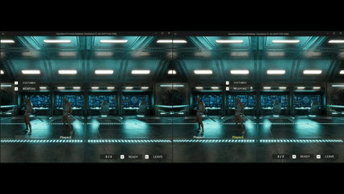
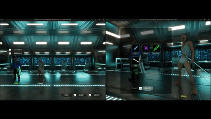
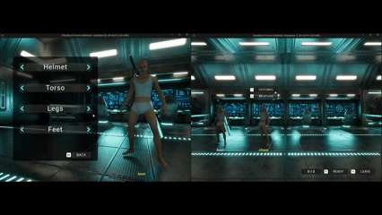

## 10 로비 구조

**로비는 세션 안에서 전원이 처음 만나는 곳이고, 게임플레이로 넘어가기 전에 고를 것을 고르는 대기실임.**

접속까지의 과정은 [7. 멀티플레이 구조](07-multiplayer-architecture.md)에서 다루고, 이 문서는 로비에 도착한 뒤를 다룸.

로비에서 정하는 것은 넷임 — **닉네임 · 캐릭터(무기) · 의상 · 준비**. 무엇을 고르든 경로는 하나로 같음.

| 층 | 클래스 | 하는 일 |
|---|---|---|
| **요청** (로컬 → 서버) | `ACBChaserController` | 플레이어의 조작을 서버로 보내는 **유일한 창구** |
| **검증** (서버 권위) | `ACBGameModeBase` · `ACBLobbyGameMode` | 공통 규칙(닉네임 다듬기 · 캐릭터 태그)과 로비 규칙(집계 · 재스폰 · 시작)을 나눠 가짐 |
| **상태** (복제) | `ACBPlayerState` · `ACBLobbyGameState` | 개인이 고른 값과 로비 전체 집계를 각각 들고 전 클라이언트에 복제 |
| **반영** (각 인스턴스) | 위젯 · 폰 | 복제된 값을 받은 쪽이 **각자 로컬로** 표시하거나 적용 |

---

### 10.1 로비 한눈에 보기


**네 기능이 전부 같은 형태임.**

요청을 컨트롤러가 받고, 통과 여부를 게임모드가 정하고, 결과는 스테이트가 들고 복제함.

| 기능 | 요청 | 검증 | 복제되는 상태 |
|---|---|---|---|
| 닉네임 | `Server_RequestSetNickname()` | `Auth_SanitizeNickname()` - 다듬기 · 중복 해소 | `PlayerName` (엔진 값) |
| 캐릭터(무기) | `Server_RequestCharacterSelection()` | `Auth_IsValidCharacterId()` - 캐릭터 카탈로그 | `SelectedCharacterId` |
| 의상 | `Server_RequestCosmeticPart()` | `IsValidCosmeticPart()` - 의상 카탈로그 | `Cosmetics` (슬롯별 태그) |
| 준비 · 시작 | `Server_RequestToggleReady()` · `Server_RequestStartMatch()` | `Auth_RefreshReadyState()` · `Auth_TryStartMatch()` | `bIsReady` + `ReadyCount` / `TotalCount` |

- **검증은 클래스에 따라 맡김.** 닉네임과 캐릭터 태그는 레벨과 무관한 공통 규칙이라 **베이스 게임모드**에, 집계와 시작 판정은 로비에서만 성립하므로 **로비 게임모드**에 둠. 의상은 지금 폰이 들고 있는 카탈로그로 판정하므로 **모듈러 메시 컴포넌트**가 답함.
- **위젯이 버튼을 감추는 것은 표시일 뿐임.** 요청은 전부 클라이언트에서 오므로 서버가 다시 봄.
- 의상 교체는 게임 규칙에 영향을 주지 않아 카탈로그 검증만 하고, 나머지 셋은 **로비인가 · 준비 전인가**를 함께 확인함.

#### ⭐ 로비는 프리뷰 액터가 아니라 실제 캐릭터를 스폰하는 방식으로 구현

|  | 프리뷰 전용 액터 | **캐릭터 스폰 (채택)** |
|---|---|---|
| 복제 · 배치 | 직접 구현 | 엔진 기본 스폰 흐름 (`PlayerStart`) |
| 프리뷰 정확도 | 실제와 어긋날 수 있음 | **완전 일치** |
| 로드 비용 | 적음 | 큼 - 다만 **대기 중에 미리 로드되어 게임 진입이 빨라짐** |

대신 로비에서 두 가지를 덮어야 함.

- **조작 차단** - 로비에서는 입력 매핑 컨텍스트를 **아예 등록하지 않음.** 처음에는 "로비 UI가 뜨면 게임플레이 입력이 걷힌다"로 만들었지만, UI가 캐릭터보다 먼저 뜨면 걷어낼 대상이 없어 **로비에서 캐릭터가 움직임.** 붙이지 않으면 순서도 UI 성공 여부도 무관해짐.
- **카메라** - 빙의하면 3인칭 뷰가 되므로 고정 카메라로 덮음 (10.5).

---

### 10.2 닉네임

**닉네임용 변수를 따로 만들지 않고 엔진의 `PlayerName` 을 그대로 씀.** 이미 복제되고, 맵을 넘어갈 때 이관되고, 리슨 서버에서는 값을 바꾸면 알림까지 엔진이 불러줌. 새 필드를 만들면 이 셋을 다시 짜야 하고, 엔진이 보는 이름과 화면에 보이는 이름이 갈라짐.

그래서 `ACBPlayerState` 가 하는 일은 **변경 신호를 얹는 것뿐임.**

**접속 시점의 기본 이름은 게임모드가 매김**

- 엔진 기본 처리를 마친 뒤 **비어 있는 가장 작은 번호**로 다시 지음. 들어온 순서대로 `Player1`, `Player2`, `Player3` 순서대로 생김.

**변경 요청은 서버가 다듬어서 받음**

| 단계 | 규칙 |
|---|---|
| 다듬기 | 제어문자 제거 → 연속 공백은 한 칸으로 → 모든 공백을 일반 스페이스로 통일 → 앞뒤 자르기 → 길이 제한 |
| 거절 | 남는 글자가 없으면 요청을 버리고 **지금 이름을 그대로 둠** |
| 중복 | 허용하지 않음. 이미 쓰는 이름이면 뒤에 번호를 붙임 (`이름` → `이름2`). 대소문자만 다른 이름도 같은 이름으로 봄 |

- 보이지 않는 특수 공백까지 일반 스페이스로 바꾸는 것은 **같아 보이는 이름을 만들지 못하게** 하려는 것.
- 중복 검사에서 **요청자 자신은 제외함.** 빼지 않으면 자기 이름을 다시 확정할 때마다 번호가 계속 붙음.
- **거절 사유를 클라이언트로 보내지 않음.** 이름은 복제되는 값이라 거절되면 값이 그대로고, 위젯이 복제된 이름을 표시하므로 입력창이 알아서 원래 값으로 돌아감.

#### 닉네임 변경 전


#### 닉네임 변경


#### 닉네임 변경 후


---

### 10.3 캐릭터(무기) 선택과 재스폰


**무기 종류가 곧 캐릭터 종류임.** 무기마다 캐릭터 BP와 로드아웃이 따로 있어서, 무기를 바꾼다는 것은 어빌리티 · 메시 · 입력이 전부 다른 캐릭터로 갈아타는 일임. 로드아웃만 교체하는 경로는 만들지 않고 **폰을 통째로 다시 스폰함.**

| 갈래 | 담당 |
|---|---|
| 고를 수 있는 목록 | `UCBCharacterCatalog` - 태그 → 캐릭터 클래스(소프트) · 표시 이름 · 아이콘 |
| 목록의 등록소 | **게임 인스턴스** - 서버(스폰 클래스 결정)와 전 클라(선택 UI)가 **폰 없이** 읽어야 하고 맵을 넘어 살아야 함 |
| 고른 값 | `ACBPlayerState::SelectedCharacterId` (복제 + 맵 이관) |
| 스폰 클래스 결정 | `ACBGameModeBase::GetDefaultPawnClassForController()` |

**스폰 클래스 결정을 베이스 게임모드에 둔 이유** — 로비의 재스폰과 게임플레이 레벨의 첫 스폰이 **같은 규칙 하나**를 씀. 넘어온 선택 값을 게임플레이 게임모드가 따로 해석할 필요가 없음. 고른 값이 카탈로그에서 사라졌으면 경고를 남기고 기본 폰으로 이어감 - 스폰을 막아 로비에 폰이 없어지는 쪽이 더 나쁨.

#### ⭐ 폰만 지우면 끝나지 않는다

- **ASC 부여분은 직접 회수해야 함.** 플레이어의 ASC 는 **PlayerState 소유**라 폰을 갈아도 살아남음. 회수하지 않으면 이전 무기의 어빌리티와 스탯이 남은 채 새 로드아웃이 얹혀 **바꿀수록 쌓임.**
- 반대로 **무기 액터는 신경 쓰지 않아도 됨.** 컴뱃 컴포넌트가 정리하므로 폰만 파괴하면 같이 사라짐 → [6. 전투 시스템](06-combat-system.md)
- **빙의를 먼저 풀고 파괴함.** 폰이 남아 있으면 엔진이 그 폰을 그대로 재사용해 캐릭터가 바뀌지 않음.
- **자리를 기억해야 함.** 엔진 기본 규칙은 비어 있는 스타트 중에서 고르므로, 폰을 지우고 다시 스폰하면 **다른 자리로 옮겨감.** 컨트롤러별로 처음 배정한 자리를 기억해 두고, 나갈 때 비움.

#### ⭐ 로드 중과 준비 중, 두 방향이 대칭으로 잠긴다

```
준비 완료 상태 → 캐릭터 변경 차단   (무기 장착 어빌리티가 활성화 후 상태라 재스폰 잠금)
로드 중       → 준비 차단          (ASC·로드아웃이 미완성인 캐릭터는 실패 처리)
```

- 재스폰된 폰은 로드아웃을 **다시 비동기 로드**하므로, 그 사이의 준비 요청은 서버가 거부함.
- 위젯 쪽은 "지금 폰이 로드됐나"를 PlayerState 의 로컬 값으로 읽어 버튼을 잠금. **이 값은 복제하지 않음**

#### 캐릭터 카탈로그
- 게임에서 선택 가능한 캐릭터를 등록하고 관리하는 곳 (게임 인스턴스가 참조하고 있음)


#### 캐릭터(무기) 변경



---

### 10.4 의상 선택

로비에서 고른 의상도 같은 경로를 탐 - 요청은 컨트롤러, 검증은 지금 폰의 의상 카탈로그, 상태는 PlayerState 임. 구조와 적용은 [9. 의상 시스템](09-cosmetic-system.md)에서 다루고, 여기서는 **로비에서만 생기는 것** 둘만 적음.

- **복제하는 것은 슬롯별 태그뿐이고 조립은 각 인스턴스가 로컬로 함.** 메시를 복제하지 않으므로 인원이 늘어도 비용이 늘지 않음.
- **캐릭터를 바꿔도 조합은 유지됨.** 새 폰이 붙으면 PlayerState 가 다시 적용함. 단 **새 캐릭터의 카탈로그에 없는 파츠는 검증에서 걸러져 빠짐.**

#### 의상 변경 메뉴


#### 의상 복제 결과


#### 의상 변경 과정


---

### 10.5 로비 화면 — 고정 카메라와 커스터마이징 뷰

**대기실 공용 카메라 한 대를 두고 전원이 같은 화면을 봄.** 접속한 캐릭터들이 한 줄로 함께 보이는 형태임.

- 구현은 **"이 플레이어의 카메라를 무엇에 맞출까"를 정하는 엔진 지점을 오버라이드**한 것 하나임. 뷰 타겟을 따로 설정하는 대신 그 결정 자체를 바꿈 - 빙의 · 재스폰 어디서 들어와도 같은 판단을 거침.
- **레벨에 로비 카메라가 없으면 엔진 기본 동작(폰을 봄)으로 돌아감.** 그래서 이 카메라는 **"여기가 로비인가"의 표식을 겸함** - 입력을 붙일지 말지도 같은 기준으로 가름.
- **화면은 뷰 타겟이 정해지고 캐릭터 준비가 끝날 때까지 검게 덮어둠.** 의상 같은 비동기 에셋이 붙기 전 모습이 한 프레임 비치는 것을 막기 위함.

**커스터마이징 뷰**는 내 캐릭터 앞으로 카메라를 당기는 **로컬 전용** 화면임.

- 카메라를 **하나 스폰해 계속 옮겨 씀.** 매번 만들고 지우면 블렌드가 끝나기 전에 대상이 사라짐.
- 캐릭터를 정면에서 본 뒤 **회전만 살짝 틀어** 캐릭터를 화면 한쪽으로 밀어냄. 반대쪽이 의상 선택 위젯 자리가 됨. 카메라를 옆으로 옮기면 캐릭터가 다시 화면 중앙으로 오기 때문.
- 뷰 상태를 플래그로 들고 있어, 캐릭터 변경으로 **재빙의가 일어나도 클로즈업이 풀리지 않음.**

---

### 10.6 준비와 인원 집계


**규칙은 준비 값이고, 무기 장착 어빌리티는 연출임.** 전투 태그를 준비 상태로 겸하면 상태가 하나 줄지만, **어빌리티가 실패하면 준비 자체가 불가능**해짐. 그래서 값이 먼저고 연출은 뒤따름 - 애니메이션만 빠지고 진행되는 쪽이 로비에서 안전함.

- 서버가 요청을 받아 **준비 여부 값을 반대로 설정하고**, 그 값에 맞는 장착 · 해제 어빌리티를 실행함.
- **연출은 서버 한 곳에서 불러도 전원 화면에 나옴.** 원격 플레이어 것은 GAS 가 소유 클라이언트로 넘겨주고, 몽타주는 어차피 GameplayCue 로 나가 시뮬 프록시까지 보이기 때문 → [3. 액션 시스템](03-action-system.md)

**인원은 세 계기로 다시 셈** — 접속 · 퇴장 · 준비 토글. 매번 플레이어 목록을 처음부터 훑어 **준비 인원과 전체 인원을 다시 계산**함. (카운터 증가/감소로 집계하지 않으므로 어떤 경로로 들어와도 값이 어긋나지 않음)

- **나가는 플레이어는 집계에서 뺌.** 퇴장 시점에는 그 PlayerState 가 아직 목록에 남아 있어서, 빼지 않으면 준비했던 사람이 나갔는데 "전원 준비"가 유지됨.
- 집계 결과는 게임 스테이트에 담겨 전 클라이언트로 복제됨.

#### ⭐ 준비 신호를 둘로 나눈 이유 — 신호를 받는 곳이 다름

| 신호 | 어디 | 누가 구독하나 |
|---|---|---|
| 내가 준비했나 | `ACBPlayerState` | 준비 중에 잠겨야 하는 위젯 (무기 변경 · 의상 교체) |
| 몇 명 중 몇 명인가 | `ACBLobbyGameState` | 인원 표시, 호스트의 시작 버튼 전환 |

후자를 전자로 대신하면 **남이 준비 버튼을 눌러도 내 위젯이 갱신되고**, 정작 값은 다시 PlayerState 에서 읽어야 해서 신호와 출처가 어긋남.

- **PlayerState 와 GameState 의 복제 도착 순서는 보장되지 않음.** 그래서 개인 준비 값이 바뀌었을 때도 집계 신호를 현재 값으로 한 번 더 방송함. 위젯은 매번 현재 상태에서 다시 계산하므로 중복 방송이 무해함.
- **구독하는 쪽은 구독 직후 현재 값을 한 번 읽어야 함.** 델리게이트는 "바뀔 때"만 오므로 위젯이 늦게 생기면 이미 지나간 변경을 놓침.

#### ⭐ 집계한 인원은 방 목록에도 실린다

호스트는 집계할 때마다 **현재 인원을 세션 광고에 갱신**함. 엔진이 알려주는 접속 수는 인원 표시에 쓸 수 없어서, 값을 우리가 직접 실어 보내야 하기 때문임 → [7.4 세션 검색 과정](07-multiplayer-architecture.md)

---

### 10.7 게임 시작과 레벨 이동


**시작 요청이 오면 서버가 넷을 다시 봄.**

| 검증 | 방법 |
|---|---|
| 중복 요청인가 | 이미 이동을 시작했으면 무시 (버튼 연타 방어) |
| 호스트인가 | 서버에서 로컬 컨트롤러인지 확인 — **리슨 서버에서 로컬인 컨트롤러는 호스트뿐임** |
| 전원 준비인가 | 집계 값으로 판정 (아무도 없는 로비는 "전원 준비"로 보지 않음) |
| 최소 인원인가 | 로비 게임모드 BP 에서 지정 (혼자서도 플레이할 수 있게 기본값은 1) |

통과하면 이동 준비를 셋 수행함.

- **세션 닫기** — 매치가 시작되면 난입을 받지 않으므로 세션을 광고에서 내림. 그래도 들어오는 접속은 게임플레이 게임모드가 거부함 → [7.5 세션 참가 과정](07-multiplayer-architecture.md)
- **시작 방송** — 이동 직전에 전원에게 알려 **각자 로비 위젯을 스스로 걷게 함.**
- **게임플레이 레벨로 이동** — 레벨 주소에 `listen` 옵션을 붙여 리슨 서버로 레벨 열기.

#### ⭐ 무엇이 맵을 넘어가나

| 값 | 넘어가나 |
|---|---|
| 닉네임 · 고른 캐릭터 · 의상 조합 | **넘어감** - PlayerState 가 새 인스턴스로 값을 옮김 |
| 준비 상태 | **넘기지 않음** - 로비 안에서만 의미가 있음 |

- 이 이관은 **seamless travel 이 켜져 있어야 동작함.** 꺼져 있으면 로비에서 고른 값이 **에러 없이 조용히 사라짐.** 베이스 게임모드에서 켜 두어 파생 게임모드가 빠뜨릴 수 없게 함.
- 값이 넘어오는 것과 적용되는 것은 별개임. 넘어온 캐릭터 태그로 **게임플레이 첫 폰이 스폰되는 것**은 10.3 의 같은 규칙이 처리함.
